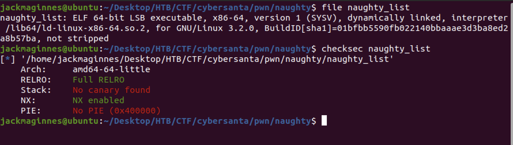
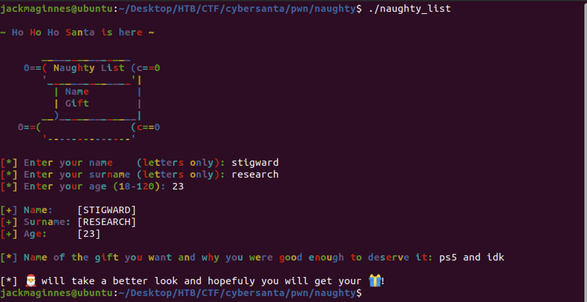
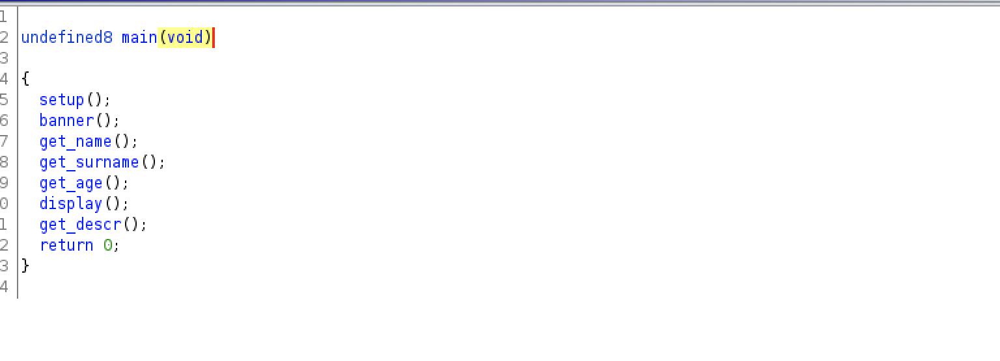
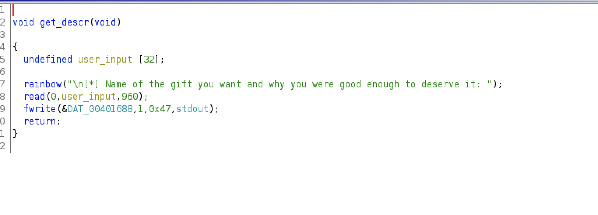
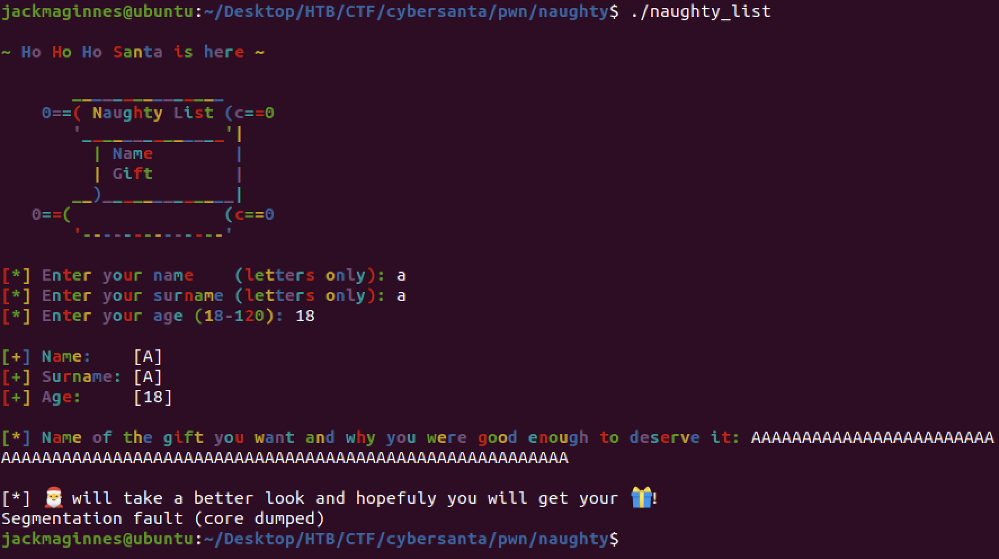

# Naughty List Pwn Challenge
## TL;DR:
Getting the flag in this challenge involves exploiting a stack based buffer
overflow and defeating ASLR and DEP to get code execution. We use a 
well established technique of leaking `puts@GOT` to get the base address of `libc`. 
After establishing this base address, we can use a "one shot" gadget 
to get RCE and retrieve the flag.

## Recon:
The download link provides us with a challenge binary, `naughty_list`,  
and it's associated `libc`. We can do some basic recon with `file` and 
`checksec`. 

 


From this we get a good idea of what protections are in place. With `NX` enabled,
we won't be able to execute our own shell code on the stack. Furthermore, we see the 
binary is dynamically linked. 

### Challenge Binary Functionality
Now that we know what protections are in place, lets check out the binary's functionality.
Running it, we see that it asks for our first name, last name, age, and what gift we want.





### Vulnerability
Reversing here isn't really needed, as we could just manually fuzz each input (which is the strategy 
I took during the CTF). However, for completeness of this write-up lets fire up Ghidra. 

We can see that the main function controls the flow of the program. There is an 
individual function for each respective step described above. 



Going through the functions, We notice that there is a potential 
vulnerability in `get_descr()`. The function has a character buffer of size 32, 
but calls `read` with  a length of 960, leading to a standard buffer overflow.



We can confirm by providing a long string (in this case 80 'A's) to the description, 
which results in a `segfault` as we would expect.




## Exploitation:
To exploit this vulnerability, we are going to use the well-known Python framework, [pwntools](https://docs.pwntools.com/en/stable/). 
We can get started with the following boiler plate code which will identify and run our challenge binary. 

```python
from pwn import *
elf = ELF('./naughty_list') 
libc = ELF('./libc.so.6')
p = elf.process()
```

Before moving on with our exploitation script, it is worth figuring out what amount of padding we need to send to the binary in order to reach the saved
return address we want to overwrite. There are plenty of ways to do this, but I tend to default to the simplist: using GDB and doing it manually.


